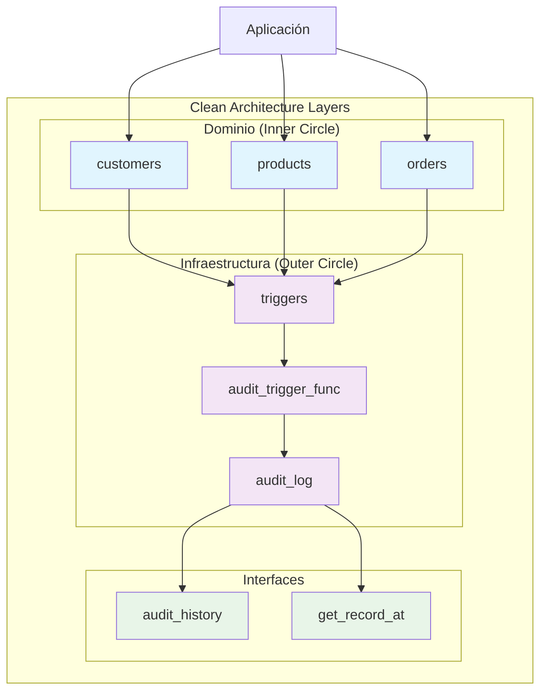

# PostgreSQL Audit Log Triggers System


Sistema de auditoría automático para PostgreSQL con triggers, time-travel queries y JSONB flexible, siguiendo Clean Architecture y principios SOLID.

---

## 🚀 Características Principales

- ✅ **Auditoría Automática**: Triggers que capturan INSERT/UPDATE/DELETE sin modificar código de aplicación
- ✅ **Time-Travel Queries**: Reconstrucción de estados históricos con `get_record_at()`
- ✅ **JSONB Flexible**: Almacena cualquier estructura de datos sin schema rígido
- ✅ **Vista Simplificada**: `audit_history` con operaciones legibles y secuenciadas
- ✅ **Testing Completo**: Suite de validación para todas las operaciones
- ✅ **Extensible**: Agregar nuevas tablas en <10 minutos sin modificar código existente
- ✅ **Clean Architecture**: Separación clara entre dominio e infraestructura

---

## 🏗️ Arquitectura del Sistema



**Separación de Concerns:**
- **Dominio**: `customers`, `products`, `orders` - reglas de negocio
- **Infraestructura**: `audit_log`, triggers - detalles técnicos
- **Interfaces**: `audit_history`, `get_record_at()` - puntos de acceso

---

## 📁 Estructura del Proyecto

```
auditlog-triggers/
├── 📄 README.md                    # Este archivo
├── 📄 LICENSE                      # Licencia MIT
├── 📄 naming_conventions.md        # Convenciones de nombres
├── 📁 config/                      # Configuración
│   └── 📄 database.env.example     # Variables de entorno
├── 📁 migrations/                   # Schema y triggers (V1-V4)
│   ├── 📄 V1__create_ecommerce_schema.sql
│   ├── 📄 V2__create_audit_log_table.sql
│   ├── 📄 V3__create_audit_trigger_function.sql
│   └── 📄 V4__apply_triggers_to_tables.sql
├── 📁 extensions/                   # Funciones avanzadas (V5-V6)
│   ├── 📄 V5__create_audit_history_view.sql
│   └── 📄 V6__create_get_record_at_function.sql
├── 📁 queries/                      # Consultas y tests
│   ├── 📄 example_audit_queries.sql
│   └── 📄 test_audit_operations.sql
├── 📁 seeds/                        # Datos de prueba
│   └── 📄 seed_ecommerce_data.sql
└── 📁 docs/                         # Documentación técnica
    ├── 📄 ERD.md                    # Diagramas y diccionario
    └── 📄 EXTENSION_GUIDE.md        # Guía de extensión
```

---

## ⚙️ Instalación y Configuración

### Prerrequisitos
- PostgreSQL 12+ con permisos de CREATE TRIGGER
- psql o cliente PostgreSQL
- Git

### Instalación (5 minutos)

```bash
# 1. Clonar el repositorio
git clone https://github.com/Fisherk2/auditlog-triggers
cd auditlog-triggers

# 2. Configurar conexión a base de datos
cp config/database.env.example config/database.env
# Editar config/database.env con tus credenciales

# 3. Aplicar migraciones en orden
psql -d your_database -f migrations/V1__create_ecommerce_schema.sql
psql -d your_database -f migrations/V2__create_audit_log_table.sql
psql -d your_database -f migrations/V3__create_audit_trigger_function.sql
psql -d your_database -f migrations/V4__apply_triggers_to_tables.sql

# 4. Aplicar extensiones
psql -d your_database -f extensions/V5__create_audit_history_view.sql
psql -d your_database -f extensions/V6__create_get_record_at_function.sql

# 5. Poblar datos de prueba
psql -d your_database -f seeds/seed_ecommerce_data.sql
```

---

## 🎯 Uso Rápido

### Ejemplo 1: Consulta de Auditoría Básica

```sql
-- Últimos 10 cambios en el sistema
SELECT 
    table_name,
    record_id,
    operation,
    changed_by,
    changed_at
FROM audit_history 
ORDER BY changed_at DESC 
LIMIT 10;
```

**Output esperado:**
```
 table_name | record_id | operation | changed_by    | changed_at
------------+-----------+-----------+---------------+---------------------------
 products   |         1 | UPDATE    | auditlog_admin| 2024-01-15 14:30:22.123
 customers  |         2 | INSERT    | auditlog_admin| 2024-01-15 14:29:15.456
 orders     |         1 | DELETE    | auditlog_admin| 2024-01-15 14:28:10.789
```

### Ejemplo 2: Time-Travel Query

```sql
-- Estado de un producto en fecha específica
SELECT * FROM get_record_at(
    'products', 
    1, 
    '2024-01-15 12:00:00-06:00'::timestamp
);
```

### Ejemplo 3: Consulta JSONB

```sql
-- Cambios de precio en productos
SELECT 
    old_data->>'price'::NUMERIC as old_price,
    new_data->>'price'::NUMERIC as new_price,
    changed_at
FROM audit_history 
WHERE table_name = 'products' 
AND operation = 'U'
AND old_data->>'price'::NUMERIC != new_data->>'price'::NUMERIC;
```

> 📖 **Más ejemplos:** Ver [`queries/example_audit_queries.sql`](queries/example_audit_queries.sql)

---

## 🧠 Decisiones Técnicas Documentadas

### Por qué Triggers AFTER en lugar de BEFORE
- **Datos validados**: Se ejecuta después de constraints y reglas de negocio
- **Integridad**: Los datos ya están confirmados en la tabla
- **Rollback seguro**: Si la auditoría falla, los datos originales permanecen

### Por qué JSONB en lugar de Columnas Fijas
- **Universalidad**: Un schema almacena datos de cualquier tabla
- **Flexibilidad futura**: Agregar columnas no modifica audit_log
- **Consultas potentes**: JSONB con GIN indexes permite búsquedas eficientes

### Por qué audit_log sin Foreign Keys al Dominio
- **Independencia**: La infraestructura no depende del dominio (Clean Architecture)
- **Survivabilidad**: Si se elimina una tabla, los registros de auditoría permanecen
- **Performance**: Evita cascadas de deletes que perderían historial

---

## 🔧 Extensión del Sistema

¿Necesitas auditar una nueva tabla? Sigue estos pasos:

```sql
-- 1. Crear trigger (3 minutos)
CREATE TRIGGER tg_nueva_tabla_audit
AFTER INSERT OR UPDATE OR DELETE ON nueva_tabla
FOR EACH ROW
EXECUTE FUNCTION audit_trigger_func();

-- 2. Validar (2 minutos)
INSERT INTO nueva_tabla (...) VALUES (...);
SELECT * FROM audit_history WHERE table_name = 'nueva_tabla';
```

> 📖 **Guía completa:** Ver [`docs/EXTENSION_GUIDE.md`](docs/EXTENSION_GUIDE.md)

**Tiempo estimado:** <10 minutos para agregar auditoría a cualquier tabla

---

## 🧪 Testing

### Ejecutar Tests

```bash
# Ejecutar suite completa de validación
psql -d your_database -f queries/test_audit_operations.sql
```

### Qué Validan los Tests
- ✅ **INSERT**: Genera registro con operation='I', old_data=NULL
- ✅ **UPDATE**: Genera registro con old_data y new_data correctos
- ✅ **DELETE**: Genera registro con operation='D', new_data=NULL
- ✅ **Time-Travel**: `get_record_at()` reconstruye estados históricos
- ✅ **Edge Cases**: UPDATE sin cambios, DELETE de registro inexistente

### Interpretación de Resultados
```
🚀 Iniciando tests de auditoría completa
✅ ESCENARIO 1: TEST PASSED - INSERT audit validation
✅ ESCENARIO 2: TEST PASSED - UPDATE audit validation  
✅ ESCENARIO 3: TEST PASSED - DELETE audit validation
✅ ESCENARIO 4: TEST PASSED - Time-Travel validation
🎉 TODOS LOS TESTS DE AUDITORÍA COMPLETADOS
```

---

## 📚 Documentación Adicional

- **[ERD.md](docs/ERD.md)**: Diagramas de entidad-relación y diccionario de datos
- **[EXTENSION_GUIDE.md](docs/EXTENSION_GUIDE.md)**: Guía paso a paso para extender el sistema
- **[naming_conventions.md](naming_conventions.md)**: Convenciones y estándares del proyecto

---

## 🤝 Contribución

¿Interesado/a en contribuir? 🎉 Consulta nuestra **[Guía de Contribución](CONTRIBUTING.MD)** para:

- 📋 Pasos detallados para configurar tu entorno
- 📝 Estándares de código y convenciones
- 🔍 Proceso de Pull Request y code reviews
- 🐛 Cómo reportar bugs y proponer features
- 📜 Código de conducta y lineamientos de colaboración

### Resumen Rápido

1. Fork del repositorio
2. Crear feature branch (`git checkout -b feature/amazing-feature`)
3. Commit cambios (`git commit -m 'Add amazing feature'`)
4. Push a la branch (`git push origin feature/amazing-feature`)
5. Abrir Pull Request

### Principios de Contribución
- Seguir Clean Architecture y SOLID principles
- Mantener compatibilidad con PostgreSQL 12+
- Incluir tests para nuevas funcionalidades
- Documentar decisiones técnicas

---

## 📄 Licencia

Este proyecto está licenciado bajo la Licencia MIT - ver el archivo [LICENSE](LICENSE) para detalles.

---

## 📞 Soporte

- **Issues**: Reportar bugs o solicitar features en GitHub Issues
- **Questions**: Usar Discussions para preguntas técnicas
- **Documentation**: Ver [`docs/`](docs/) para guías detalladas

---

## 🏆 Arquitectura y Patrones

- **Clean Architecture**: Separación dominio/infraestructura
- **Strategy Pattern**: `audit_trigger_func()` para I/U/D
- **Memento Pattern**: `get_record_at()` para time-travel
- **Facade Pattern**: `audit_history` simplifica consultas
- **Observer Pattern**: Triggers observan cambios

---

**Estado del Proyecto**: ✅ MVP Completado - Listo para producción y extensión