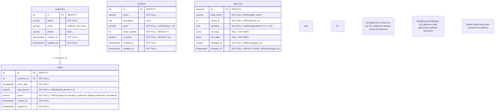
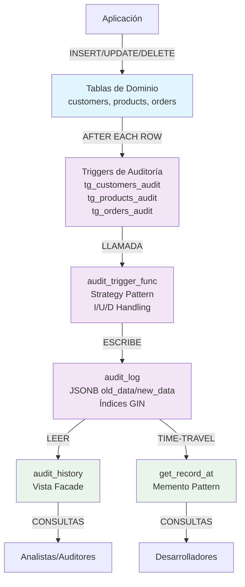

# Entity Relationship Diagram (ERD) - Sistema de Auditoría

## Overview

Este documento describe el modelo de datos del sistema de auditoría PostgreSQL, siguiendo los principios de Clean Architecture con clara separación entre dominio e infraestructura.

---

## 1. Diagrama ERD Principal



---

## 2. Diagrama de Flujo de Auditoría



---

## 3. Diccionario de Datos

| Entidad | Atributo | Tipo de Dato | Constraints | Descripción |
|---------|----------|--------------|-------------|-------------|
| **customers** | id | int | PK, IDENTITY, NOT NULL | Identificador único del cliente |
| | name | varchar(100) | NOT NULL | Nombre completo del cliente |
| | email | varchar(255) | UNIQUE, NOT NULL | Email único del cliente |
| | phone | varchar(20) | NULL | Teléfono (opcional) |
| | created_at | timestamptz | NOT NULL | Timestamp de creación |
| | updated_at | timestamptz | NOT NULL | Timestamp de última actualización |
| **products** | id | int | PK, IDENTITY, NOT NULL | Identificador único del producto |
| | name | varchar(100) | NOT NULL | Nombre del producto |
| | description | text | NULL | Descripción detallada (opcional) |
| | price | numeric(10,2) | NOT NULL, CHECK(price > 0) | Precio unitario |
| | stock_quantity | int | NOT NULL, DEFAULT 0 | Cantidad en inventario |
| | is_active | boolean | NOT NULL, DEFAULT true | Producto activo/inactivo |
| | created_at | timestamptz | NOT NULL | Timestamp de creación |
| | updated_at | timestamptz | NOT NULL | Timestamp de última actualización |
| **orders** | id | int | PK, IDENTITY, NOT NULL | Identificador único de la orden |
| | customer_id | int | FK, NOT NULL | Referencia a customers.id |
| | order_date | timestamptz | NOT NULL | Fecha de la orden |
| | total_amount | numeric(10,2) | NOT NULL, CHECK(total_amount > 0) | Monto total |
| | status | varchar(20) | NOT NULL, CHECK(status IN ('pending','confirmed','shipped','delivered','cancelled')) | Estado de la orden |
| | created_at | timestamptz | NOT NULL | Timestamp de creación |
| | updated_at | timestamptz | NOT NULL | Timestamp de última actualización |
| **audit_log** | id | bigserial | PK, IDENTITY, NOT NULL | Identificador único del registro de auditoría |
| | table_name | varchar(100) | NOT NULL, INDEX | Nombre de la tabla auditada |
| | record_id | int | NOT NULL, INDEX | ID del registro modificado |
| | operation | char(1) | NOT NULL, CHECK(operation IN ('I','U','D')) | Tipo de operación |
| | old_data | jsonb | NULL, GIN INDEX | Estado anterior del registro |
| | new_data | jsonb | NULL, GIN INDEX | Estado nuevo del registro |
| | changed_by | varchar(100) | NOT NULL, INDEX | Usuario que realizó el cambio |
| | changed_at | timestamptz | NOT NULL, DEFAULT NOW(), INDEX | Timestamp del cambio |

---

## 4. Decisiones de Diseño Documentadas

### 4.1 Por qué audit_log no tiene foreign keys a tablas de dominio

**Decisión:** audit_log almacena `table_name` y `record_id` como texto y entero respectivamente, sin foreign keys.

**Por qué (Clean Architecture):**
- **Independencia del dominio:** La infraestructura de auditoría no debe depender de la estructura del dominio
- **Flexibilidad:** Permite auditar cualquier tabla sin modificar constraints
- **Survivabilidad:** Si se elimina una tabla de dominio, los registros de auditoría permanecen
- **Performance:** Evita cascadas de deletes que podrían perder historial

### 4.2 Por qué usar JSONB en lugar de columnas fijas

**Decisión:** old_data y new_data usan JSONB en lugar de columnas tipadas específicas.

**Por qué:**
- **Universalidad:** Un mismo schema almacena datos de cualquier tabla de dominio
- **Flexibilidad futura:** Si se agregan columnas a tablas de dominio, no se modifica audit_log
- **Consultas potentes:** JSONB con GIN indexes permite búsquedas eficientes
- **Versionamiento completo:** Almacena el estado completo del registro, no solo campos cambiados

### 4.3 Por qué triggers AFTER en lugar de BEFORE

**Decisión:** Triggers configurados como `AFTER INSERT OR UPDATE OR DELETE FOR EACH ROW`.

**Por qué:**
- **Datos validados:** AFTER se ejecuta después de que las constraints se validan
- **Integridad garantizada:** Los datos ya están confirmados en la tabla
- **Rollback seguro:** Si la auditoría falla, los datos originales ya están guardados
- **Performance:** No bloquea la operación original durante la auditoría

---

## 5. Ejemplos de Consulta

### 5.1 Consulta básica de historial

```sql
-- Historial de cambios del customer_id = 1
SELECT 
    operation,
    changed_by,
    changed_at,
    old_data,
    new_data
FROM audit_history 
WHERE table_name = 'customers' 
AND record_id = 1
ORDER BY changed_at DESC;
```

**Propósito:** Trazar todos los cambios de un cliente específico para análisis forense.

### 5.2 Consulta con JSONB

```sql
-- Cambios de precio en productos mayores a $100
SELECT 
    record_id,
    old_data->>'price'::NUMERIC as old_price,
    new_data->>'price'::NUMERIC as new_price,
    changed_at
FROM audit_history 
WHERE table_name = 'products'
AND operation = 'U'
AND new_data->>'price'::NUMERIC > 100
ORDER BY changed_at DESC;
```

**Propósito:** Analizar cambios de precios en productos de alto valor usando operadores JSONB.

### 5.3 Time-Travel Query

```sql
-- Estado del product_id = 1 en fecha específica
SELECT * FROM get_record_at(
    'products', 
    1, 
    '2024-01-15 12:00:00-06:00'::timestamp
);
```

**Propósito:** Reconstruir estado histórico de un registro para cumplimiento o análisis.

---

## 6. Referencias Cruzadas

- **[V1__create_ecommerce_schema.sql](../migrations/V1__create_ecommerce_schema.sql)**: Creación de tablas de dominio
- **[V2__create_audit_log_table.sql](../migrations/V2__create_audit_log_table.sql)**: Creación de tabla audit_log
- **[V3__create_audit_trigger_function.sql](../migrations/V3__create_audit_trigger_function.sql)**: Función audit_trigger_func()
- **[V4__apply_triggers_to_tables.sql](../migrations/V4__apply_triggers_to_tables.sql)**: Aplicación de triggers
- **[V5__create_audit_history_view.sql](../extensions/V5__create_audit_history_view.sql)**: Vista audit_history
- **[V6__create_get_record_at_function.sql](../extensions/V6__create_get_record_at_function.sql)**: Función get_record_at()

---

## 7. Limitaciones Conocidas

1. **Performance en volumen alto:** El sistema está optimizado para auditoría, no para OLTP de alto volumen
2. **Time-travel limitado:** La función get_record_at() no reconstruye relaciones entre tablas
3. **JSONB storage:** Los datos JSONB ocupan más espacio que columnas tipadas fijas
4. **No rollback de auditoría:** Una vez escrito en audit_log, los registros no se modifican

---

## 8. Arquitectura y Patrones

- **Clean Architecture:** Separación clara entre dominio (customers, products, orders) e infraestructura (audit_log)
- **Strategy Pattern:** audit_trigger_func() implementa diferentes estrategias para I/U/D
- **Memento Pattern:** get_record_at() permite restaurar estados históricos
- **Facade Pattern:** audit_history simplifica consultas complejas
- **Observer Pattern:** Triggers observan cambios en tablas de dominio